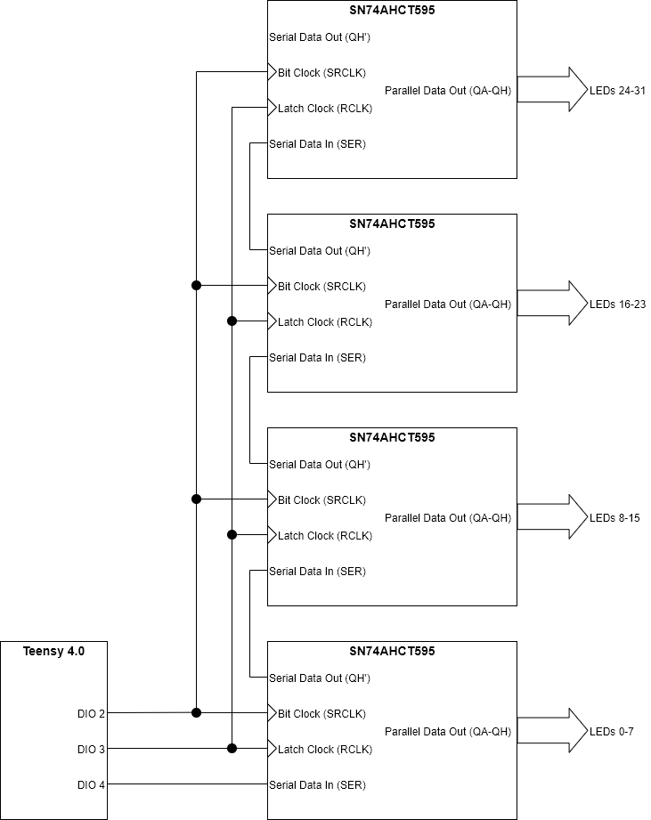

# TriantaduoWS2811
A library to drive 32 simultaneous WS28XX streams simultaneously from a Teensy 4.0.  The system uses external shift registers along with the FlexIO and DMA resources of the processor to minimize Teensy pin count and processor resource consumption.

## Introduction
When the Teensy 4.0 was released, my first thought was "What would a hobbyist do with all that horsepower?"  The obvious answer was: flash LEDs.  With this system you can flash a lot of LEDs, very fast.  How many and how fast?  That's a hard question.  The short answer is 1.065 million WS* LED updates per second, spread across 32 channels.  Give or take.  To put that in more practical terms, that's 32 channels of 1000 LEDs per channel at 33 frames per second.  Or 32 channels of 100 LEDs per channel at 330 frames per second.  You get the idea.

An arbitrary constraint I imposed on myself was to minimize pin count and processor overhead on the Teensy.  I settled for three Teensy pins and zero processor overhead through the magic of FlexIO and DMA by using external shift registers.  External component use was necessary anyway due to the need to translate from 3.3V to 5V to drive the LED strips.  The shift registers are 5V parts, so they accomplish that translation while also freeing processor resources

## Top Level Description
The following sections will detail the hardware and software architecture of the system.

### Electrical Elements
The system is straightforward, just a Teensy 4.0 and four cascaded shift registers.  The data moves relatively quickly, with a bit clock of 102.4 MHz.  This means that good layout practices are a must for the three high-speed, timing critical lines: bit clock, latch clock, and serial data.  AHCT logic is used for two reasons: it meets the speed requirement, and the outputs are natively 5V, so no need for level translation before sending the data off to the LED strings.

### Firmware
On the firmware side, the logic consists of two basic blocks within the RT1062 processor.  The first is a single FlexIO block, the second is a single DMA channel.  In both cases I've attempted to use the standard libraries for accomplishing these things, but in places I've had to get creative.  That's equally likely to be due to my own ignorance as it is some fundamental limitation of the library.

#### FlexIO
The FlexIO module in this processor is a real treat.  At the highest level, a FlexIO is a bunch of shift registers and timers tied to input and output pins on the microcontroller.  Through various register settings, one can implement a number of different serial and parallel interfaces operating at nearly any speed imaginable.  As long as that speed is less than 120 MHz.  In this design, I use the resources of a single FlexIO block, to wit: four shifters and two timers.

#### DMA
Ah, black magic it is.  Not really, Paul's library does a good job of insulating one from descending into Reference Manual madness.  I still went there, but mostly to scratch my own masochistic itch; and also because I like to know what's going on under the hood.  In this design I use a single DMA channel, along with the scatter/gather functionality and four Transfer Control Descriptors (TCDs), wrapped in the library's DMASettings object.
